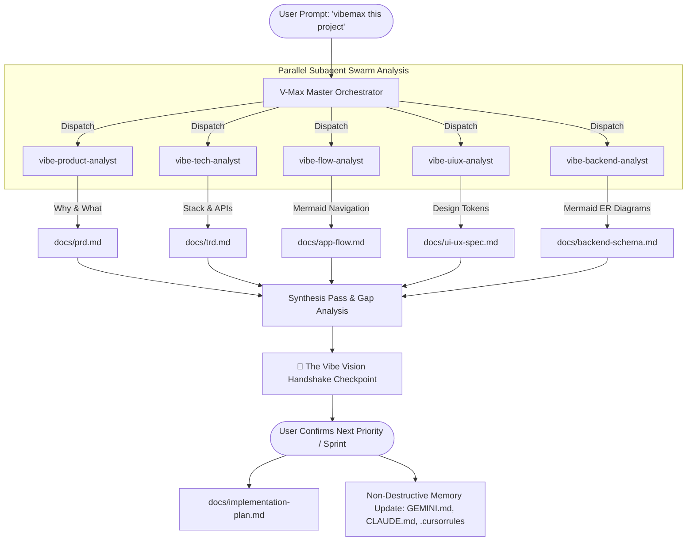

# ⚡ V-Max (Vibemax): The 6-Doc Agentic Swarm Framework for Vibe Coding

<div align="center">

[](https://opensource.org/licenses/MIT)
[](https://antigravity.google)
[](https://claude.ai)
[](https://cursor.com)
[](https://gemini.google.com)

**Transform any messy AI pair programming session into a precision-engineered software development pipeline.**

[Interactive HTML Guide (Single-File / PDF)](./V-MAX_GUIDE.html) • [1-Click Google Drive ZIP](https://drive.google.com) • [Quick Start & Setup Options](#-quick-start--setup-options) • [The 6 Living Documents](#-the-6-essential-living-documents) • [Swarm Architecture](#-5-specialist-parallel-swarm-architecture)

</div>

---

## ⚡ What is V-Max?

**V-Max (Vibemax)** is an open-source agentic skill and autonomous living documentation framework designed to solve the single greatest bottleneck in modern AI pair programming and Vibe Coding: **Context Window Decay & AI Amnesia**.

When vibe coding with tools like Google Antigravity, Claude Code, Cursor, or ChatGPT, models work brilliantly in the first 10 minutes. But as codebases grow past a few files, models start hallucinating:
* ❌ Inventing conflicting database column names and breaking SQL schemas.
* ❌ Generating mismatched UI colors, buttons, and padding on every turn.
* ❌ Creating orphaned pages, dead links, and broken auth redirects.
* ❌ Forgetting architectural decisions made 10 prompts earlier.

### 🛡️ The V-Max Solution
V-Max introduces **The 6 Essential Living Documents** in your project (`docs/`) and deploys a **5-Specialist Parallel Subagent Swarm** to reverse-engineer any existing repository (or scaffold new ones), conduct an **Interactive Vibe Vision Handshake**, and non-destructively bind the architecture to your AI memory files (`GEMINI.md`, `CLAUDE.md`, `.cursorrules`).



---

## 📊 Why V-Max? (Coding With vs. Without V-Max)

| Development Dimension | 🚫 Vibe Coding Without V-Max | ⚡ V-Max Supercharged Vibe Coding |
| :--- | :--- | :--- |
| **Context Retention** | AI forgets previous architecture after several prompts; creates conflicting patterns. | **Zero context drift.** Core architectural truth is permanently grounded in structured, token-efficient doc files. |
| **UI/UX Consistency** | Random button paddings, inconsistent color palettes, mismatched font hierarchies. | **Pixel-perfect design tokens.** UI components strictly inherit exact Tailwind/CSS variables from `docs/ui-ux-spec.md`. |
| **Database Integrity** | Guesses table names, breaks foreign keys, creates redundant DB columns. | **Immutable schema contracts.** Generates and adheres to visual Mermaid ER diagrams in `docs/backend-schema.md`. |
| **Screen Navigation** | Creates dead routes, orphaned components, and broken auth redirects. | **Explicit visual mapping.** Complete Mermaid user journey charts in `docs/app-flow.md`. |
| **Project Resumption** | Returning to an older project requires 20+ prompts to get the AI up to speed. | **Instant 30-second bootstrap.** The AI reads `docs/` and immediately knows the exact project status and next task. |
| **Cross-IDE Sync** | Switching between Antigravity, Claude Code, and Cursor breaks agent memory. | **Unified Universal Memory.** `GEMINI.md`, `CLAUDE.md`, and `.cursorrules` share the exact same source of truth. |

---

## 📚 The 6 Essential Living Documents

Every project analyzed or initialized with V-Max maintains 6 living documents in `docs/`:

1. **`docs/prd.md` (Product Requirement Document)**: Outlines the **What** and **Why** of the app. Executive overview, target personas, problem/solution statement, and prioritized feature matrix (Shipped vs. In-Progress vs. Planned).
2. **`docs/trd.md` (Technical Requirement Document)**: Defines the **How** and technical guardrails. Framework versions, directory tree, third-party APIs, environment variable configs, build scripts, and security constraints.
3. **`docs/app-flow.md` (Application Flow & Navigation)**: Maps out the visual screen hierarchy and user journeys. Visual Mermaid flowchart of every screen/modal, comprehensive route matrix, and sequence diagrams for core user workflows.
4. **`docs/ui-ux-spec.md` (UI/UX Design Spec Sheet)**: Establishes the visual identity and design system tokens. Hex/HSL color palette, typography scale, spacing system, reusable component classes (buttons, cards, inputs, dialogs), Dark/Light mode tokens.
5. **`docs/backend-schema.md` (Backend Schema & Data Architecture)**: Details data models and backend contracts. Visual Mermaid Entity-Relationship (ER) diagram, table schemas, primary/foreign keys, indexes, and API endpoint contracts (REST/tRPC/GraphQL).
6. **`docs/implementation-plan.md` (Living Implementation Plan)**: Dictates the order of operations and real-time project roadmap. Phased milestones with task checkboxes `[x]`, active sprint backlog, immediate next build step, and changelog.

---

## 🤖 5-Specialist Parallel Swarm Architecture

V-Max doesn't overload a single prompt. It dispatches a team of 5 specialized subagents working simultaneously:

* **`vibe-product-analyst`**: Scans commit history, user-facing copy, and domain services to reverse-engineer business logic into `docs/prd.md`.
* **`vibe-tech-analyst`**: Audits `package.json`, `.env.example`, build scripts, and external SDKs into `docs/trd.md`.
* **`vibe-flow-analyst`**: Inspects page routers, layout trees, and modals to build visual Mermaid navigation maps in `docs/app-flow.md`.
* **`vibe-uiux-analyst`**: Analyzes `tailwind.config`, `globals.css`, and UI components to produce design tokens in `docs/ui-ux-spec.md`.
* **`vibe-backend-analyst`**: Examines Prisma/SQL/Mongoose models and API handlers to generate Mermaid ER diagrams in `docs/backend-schema.md`.
* **Lead Agent Synthesis & `vibe-sync-agent`**: Conducts the **Vibe Vision Handshake**, synthesizes the project roadmap in `docs/implementation-plan.md`, and safely injects guidelines into `GEMINI.md`, `CLAUDE.md`, and `.cursorrules`.

---

## 🤝 The Vibe Vision Handshake Checkpoint

A codebase can only tell the AI what has been built *in the past*. Only **you** know what you want to build *next*.

At the end of every scan, V-Max presents:
1. **State of the Union**: Overall progress % and verified working modules.
2. **Detected Gaps & Half-Built Items**: Incomplete endpoints, missing routes, TODO markers, or pending UI flows.
3. **2-3 High-Impact Recommended Next Steps**: Concrete options to finish half-developed work or launch new features.
4. **The Alignment Question**: Asks you what you want to build next. Once you reply, V-Max instantly locks your exact priority into the **Active Sprint** in `docs/implementation-plan.md` and begins high-speed execution!

---

## 🚀 Quick Start & Setup Options

V-Max offers **3 simple setup options** depending on your workflow and experience level:

### Option A: Global 1-Click Setup (Best for Power Users & Antigravity / Gemini CLI)
Run this command once in your terminal:
```bash
git clone https://github.com/vickee2025/v-max.git
cd v-max/vibemax
chmod +x install.sh && ./install.sh
```

**🔍 What `install.sh` does under the hood:**
1. Copies the `vibemax/` skill package into `~/.gemini/config/skills/vibemax/`.
2. Registers `~/.gemini/config/skills` inside `~/.gemini/config/skills.json`.
3. Makes helper audit scripts executable.
4. **The Result**: You never have to manually load or reference file paths again! In **ANY** project folder on your machine, simply type `/vibemax` in Antigravity or Gemini CLI to instantly run the swarm.

---

### Option B: Zero-Install Project Drop-in (Best for Laymen & Team Repositories)
No terminal configuration needed!
1. Download `vmax-skill-package.zip` from Google Drive (or clone this repo).
2. Copy the `vibemax/` folder directly into your project as `.agents/skills/vibemax/` (or keep it in the project root).
3. In your AI chat (Antigravity, Cursor, or Claude), simply say:
   ```text
   Please use the vibemax skill in this folder to scan and generate all 6 living docs in docs/.
   ```

---

### Option C: Multi-IDE Direct Prompt (Claude Code, Cursor, Codex, ChatGPT)
You don't need any installer—just reference the skill in your prompt:

#### 1. In Google Antigravity & Gemini CLI:
```text
/vibemax
```
*(Or: "Please vibemax this project: dispatch the subagent swarm, generate the 6 living docs in docs/, and conduct the vision handshake.")*

#### 2. In Anthropic Claude Code:
```text
Please read vibemax/SKILL.md and execute the Vibemax workflow: scan this project, create the 6 living docs in docs/, conduct the vision handshake, and update CLAUDE.md.
```

#### 3. In Cursor IDE (Composer `Cmd+I` / `Ctrl+I`):
```text
@vibemax/SKILL.md Vibemax this project. Scan the codebase, create docs/ with all 6 essential documents, conduct the vision handshake, and update .cursorrules.
```

#### 4. Daily Continuous Sync Prompt (Any IDE):
```text
Vibemax sync: audit recent git diff and update docs/ and implementation-plan.md.
```

---

## 📄 License & Community
Distributed under the **MIT License**. Created with ❤️ by Vickee and the AI Agent community.
Contributions, issues, and feature requests are welcome!
