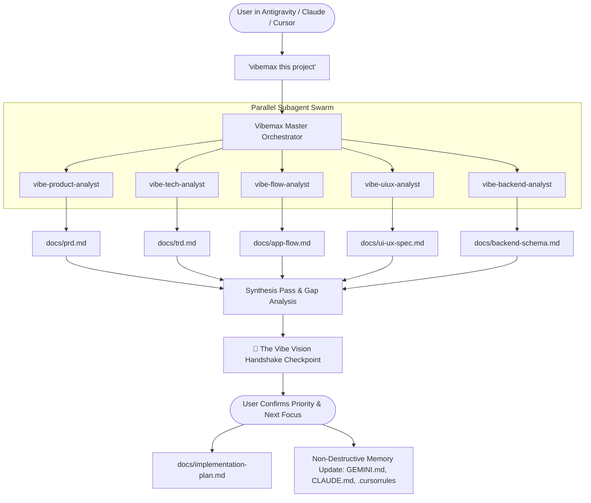

# ⚡ Vibemax: The Autonomous Living Documentation & Swarm Architecture Engine

> **Supercharge your AI Pair Programming & Vibe Coding Sessions to Maximum Velocity.**  
> Compatible with **Google Antigravity**, **Anthropic Claude Code**, **Cursor IDE**, and **Gemini CLI**.

---

## 📖 1. Introduction & Overview

**Vibemax** is an enterprise-grade agentic skill and autonomous documentation engine designed to eliminate the single biggest bottleneck in modern AI pair programming: **Context Window Decay & Architectural Drift**.

When building applications with AI, models excel in the first 10 minutes. But as projects grow, models suffer from **"AI amnesia"**—they hallucinate database schemas, generate mismatched UI styling, invent broken route paths, and duplicate already solved code.

**Vibemax solves this permanently.**

By deploying a **5-Specialist Parallel Subagent Swarm**, Vibemax deep-scans and reverse-engineers any codebase, generates **The 6 Essential Living Documents** in `docs/`, conducts an **Interactive Vibe Vision Handshake** to align on your immediate development priority, and binds everything to the project's AI memory files (`GEMINI.md`, `CLAUDE.md`, `.cursorrules`, `.agents/rules/vibe-docs.md`).



---

## 🤝 2. The Vibe Vision Handshake Checkpoint

A codebase can only reveal the *past and present* (what has been built, and what is half-built). Only **you** know the *future* (your immediate business goals, feature pivots, and what you want to build next).

At the end of the reverse-engineering scan, Vibemax presents:
1. **State of the Union**: Overall progress % and verified working modules.
2. **Detected Gaps & Half-Built Items**: Incomplete endpoints, missing routes, TODO markers, or pending UI flows.
3. **2-3 High-Impact Recommended Next Steps**: Concrete options to finish half-developed work or launch new features.
4. **The Alignment Question**: Asks you what you want to build next. Once you reply, Vibemax instantly locks your exact priority into the **Active Sprint** in `docs/implementation-plan.md` and begins high-speed execution!

---

## 📊 3. The Efficiency Multiplier: Coding With vs. Without Vibemax

| Development Dimension | 🚫 Standard Vibe Coding (Without Vibemax) | ⚡ Vibemax Supercharged (With Vibemax) |
| :--- | :--- | :--- |
| **Context Retention** | AI forgets previous architecture after several prompts; creates conflicting patterns. | **Zero context drift.** Core truth is permanently grounded in structured, token-efficient doc files. |
| **UI/UX Consistency** | Random button paddings, inconsistent color palettes, mismatched font hierarchies. | **Pixel-perfect design tokens.** UI components strictly inherit exact Tailwind/CSS variables from `docs/ui-ux-spec.md`. |
| **Database Integrity** | Guesses table names, breaks foreign keys, creates redundant DB columns. | **Immutable schema contracts.** Generates and adheres to visual Mermaid ER diagrams in `docs/backend-schema.md`. |
| **Screen Navigation** | Creates dead routes, orphaned components, and broken auth redirects. | **Explicit visual mapping.** Complete Mermaid user journey charts in `docs/app-flow.md`. |
| **Project Resumption** | Returning to an older project requires 20+ prompts to get the AI up to speed. | **Instant 30-second bootstrap.** The AI reads `docs/` and immediately knows the exact project status and next task. |
| **Cross-IDE Sync** | Switching between Antigravity, Claude Code, and Cursor breaks agent memory. | **Unified Universal Memory.** `GEMINI.md`, `CLAUDE.md`, and `.cursorrules` share the exact same source of truth. |

---

## 📚 4. The 6 Essential Living Documents

Every Vibemax project maintains 6 living documents in the `docs/` directory:

1. **`docs/prd.md` (Product Requirement Document)**
   * Outlines the **What** and **Why** of the app.
   * Executive overview, target personas, problem/solution statement, and prioritized feature matrix (Shipped vs. In-Progress vs. Planned).

2. **`docs/trd.md` (Technical Requirement Document)**
   * Defines the **How** and technical guardrails.
   * Framework versions, directory tree, third-party APIs, environment variable configs, build scripts, and security constraints.

3. **`docs/app-flow.md` (Application Flow & Navigation)**
   * Maps out the visual screen hierarchy and user journeys.
   * Visual Mermaid flowchart of every screen/modal, comprehensive route matrix, and sequence diagrams for core user workflows.

4. **`docs/ui-ux-spec.md` (UI/UX Design Spec Sheet)**
   * Establishes the visual identity and design system tokens.
   * Hex/HSL color palette, typography scale, spacing system, reusable component classes (buttons, cards, inputs, dialogs), Dark/Light mode tokens.

5. **`docs/backend-schema.md` (Backend Schema & Data Architecture)**
   * Details data models and backend contracts.
   * Visual Mermaid Entity-Relationship (ER) diagram, table schemas, primary/foreign keys, indexes, and API endpoint contracts (REST/tRPC/GraphQL).

6. **`docs/implementation-plan.md` (Living Implementation Plan)**
   * Dictates the order of operations and real-time project roadmap.
   * Phased milestones with task checkboxes `[x]`, active sprint backlog, immediate next build step, and changelog.

---

## 🤖 5. The 5-Specialist Parallel Subagent Swarm

When Vibemax runs, it does not rely on a single overloaded prompt. It dispatches a **coordinated swarm of 5 specialized subagents** concurrently:

```
┌────────────────────────────────────────────────────────────────────────┐
│                      VIBEMAX MASTER ORCHESTRATOR                       │
└────────────────────────────────────────────────────────────────────────┘
       │                 │                │               │           │
       ▼                 ▼                ▼               ▼           ▼
┌──────────────┐ ┌──────────────┐ ┌─────────────┐ ┌─────────────┐ ┌───────────────┐
│vibe-product- │ │  vibe-tech-  │ │ vibe-flow-  │ │ vibe-uiux-  │ │ vibe-backend- │
│   analyst    │ │   analyst    │ │   analyst   │ │   analyst   │ │    analyst    │
│              │ │              │ │             │ │             │ │               │
│ • READMEs    │ │ • Manifests  │ │ • Routes    │ │ • Tailwind  │ │ • Prisma/SQL  │
│ • User Copy  │ │ • Configs    │ │ • Pages     │ │ • CSS Vars  │ │ • ORM Models  │
│ • Git Log    │ │ • API Keys   │ │ • Modals    │ │ • UI Comps  │ │ • Endpoints   │
│ • Logic      │ │ • Scripts    │ │ • Mermaid   │ │ • Tokens    │ │ • Mermaid ER  │
└──────────────┘ └──────────────┘ └─────────────┘ └─────────────┘ └───────────────┘
       │                 │                │               │           │
       ▼                 ▼                ▼               ▼           ▼
  docs/prd.md       docs/trd.md     docs/app-flow.md docs/ui-ux-spec.md docs/backend-schema.md
       │                 │                │               │           │
       └─────────────────┴────────────────┼───────────────┴───────────┘
                                          ▼
                         ┌──────────────────────────────────┐
                         │   LEAD AGENT SYNTHESIS PASS      │
                         │   • Gap & Stub Detection         │
                         │   • Vibe Vision Handshake        │
                         │   • docs/implementation-plan.md  │
                         │   • Non-destructive Memory Sync  │
                         └──────────────────────────────────┘
```

---

## 📦 6. Package Structure

```text
~/.gemini/config/skills/vibemax/
├── SKILL.md                          # Master orchestrator & trigger router
├── README.md                         # This comprehensive user & colleague guide
├── install.sh                        # One-command global installer script
├── templates/                        # The 6 gold-standard living document templates
│   ├── 01-prd-template.md           
│   ├── 02-trd-template.md           
│   ├── 03-app-flow-template.md      
│   ├── 04-ui-ux-spec-template.md    
│   ├── 05-backend-schema-template.md
│   └── 06-implementation-plan-template.md
├── subagents/                        # Specialized subagent definitions
│   ├── vibe-product-analyst.md      
│   ├── vibe-tech-analyst.md         
│   ├── vibe-flow-analyst.md         
│   ├── vibe-uiux-analyst.md         
│   ├── vibe-backend-analyst.md      
│   └── vibe-sync-agent.md           
├── scripts/                          # Automated local helper utilities
│   ├── audit-docs.py                # Audits git diff against docs to detect untracked drift
│   └── init-vibe-memory.sh          # Non-destructively injects AI memory files
└── references/                       # Operational standards
    ├── diagram-standards.md         # Mermaid syntax standards for flows and ER models
    └── memory-sync-protocol.md      # Cross-IDE instruction set (Antigravity/Claude/Cursor/Gemini)
```

---

## 🚀 7. Installation & Colleague Onboarding Guide

### For You & Your Colleagues (One-Command Setup)

1. **Download / Clone the Folder**:
   Download the `vibemax` folder from your shared Google Drive, Slack, or GitHub repository.

2. **Run the Installer**:
   Open your terminal in the downloaded `vibemax` folder and run:
   ```bash
   chmod +x install.sh && ./install.sh
   ```

   *What this script does automatically:*
   - Copies `vibemax` to `~/.gemini/config/skills/vibemax/`.
   - Registers the skills path in `~/.gemini/config/skills.json`.
   - Sets correct executable permissions for audit & memory scripts.

---

## 🎯 8. Multi-IDE Activation Prompts & How to Use

Once installed, you can trigger Vibemax in any project using your favorite AI editor:

### Option A: In Google Antigravity & Gemini CLI

Open your terminal or Antigravity chat in any project directory and enter:

```text
/vibemax
```
*or simply say:*
```text
Please vibemax this project: analyze the codebase with the subagent swarm, generate the 6 living docs in docs/, conduct the vision handshake, and initialize memory files.
```

---

### Option B: In Anthropic Claude Code

```text
Please read ~/.gemini/config/skills/vibemax/SKILL.md and execute the Vibemax workflow: scan this project, create the 6 living docs in docs/, conduct the vision handshake, and update CLAUDE.md.
```

---

### Option C: In Cursor IDE

In Cursor Composer (`Cmd+I` or `Ctrl+I`), enter:

```text
@~/.gemini/config/skills/vibemax/SKILL.md Vibemax this project. Scan the codebase, create docs/ with all 6 essential documents, conduct the vision handshake, and update .cursorrules.
```

---

## 🔄 9. Continuous Maintenance & Living Synchronization

As you build new features, Vibemax keeps your documentation perfectly synced:

1. **Autonomous In-Turn Updates**: The rules injected into `GEMINI.md` / `CLAUDE.md` mandate that whenever an agent modifies routes, schemas, or UI tokens, it updates `docs/` before ending the turn.
2. **On-Demand Audit**: Run the drift audit anytime in your project root:
   ```bash
   python3 ~/.gemini/config/skills/vibemax/scripts/audit-docs.py
   ```
3. **Quick Sync Prompt**:
   ```text
   Vibemax sync: audit the recent git diff and update docs/ and implementation-plan.md.
   ```
