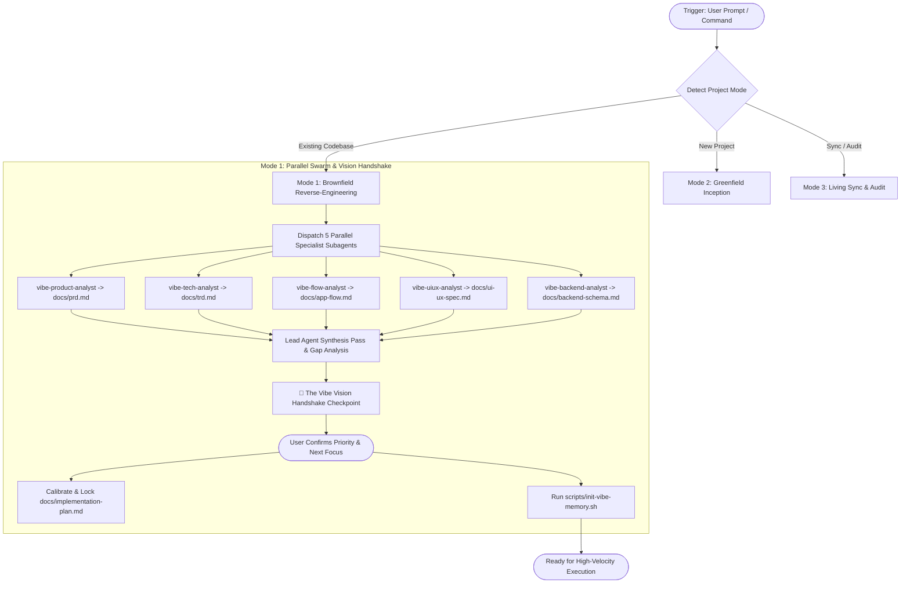

# Vibemax: The Autonomous Living Documentation & Swarm Architecture Engine

Vibemax elevates AI pair programming and Vibe Coding to peak performance by transforming any codebase into a self-documenting, architecturally coherent system. It operates across three distinct modes:

1. **Mode 1: Brownfield Reverse-Engineering** (Default for existing/in-progress repositories).
2. **Mode 2: Greenfield Inception** (For brand new projects starting from ideation).
3. **Mode 3: Living Sync & Drift Audit** (Continuous synchronization on code changes or on demand).

---

## The 6 Essential Living Documents

Every project analyzed or managed with Vibemax maintains 6 documents in `docs/`:

1. **`docs/prd.md`** - Product Requirement Document (Why & What, Personas, Problem/Solution, Feature Matrix).
2. **`docs/trd.md`** - Technical Requirement Document (Tech Stack, APIs, Environment, Build Scripts, Guardrails).
3. **`docs/app-flow.md`** - Application Navigation & User Journeys (Mermaid Flowcharts, Screen Matrix, State Flows).
4. **`docs/ui-ux-spec.md`** - UI/UX Design Spec Sheet (Color Tokens, Typography Scale, Component Matrix, Dark/Light mode).
5. **`docs/backend-schema.md`** - Backend Schema & Data Architecture (Mermaid ER Diagrams, Table Specs, API Contracts).
6. **`docs/implementation-plan.md`** - Living Implementation Plan (Milestone Gantt, Phase Checklists, Active Sprint Backlog).

---

## Workflow Execution Protocol



---

## Step-by-Step Instructions for the Lead Agent

### Phase 1: Mode Detection & Workspace Scan
1. Check repository root:
   - Does `package.json`, `requirements.txt`, `Cargo.toml`, or source code exist? -> **Mode 1 (Brownfield)**.
   - Is the directory empty or only contains an initial README? -> **Mode 2 (Greenfield)**.
   - Are all 6 docs present in `docs/` and user asks to sync or finished a task? -> **Mode 3 (Living Sync)**.

---

### Phase 2: Mode 1 Execution (Brownfield Swarm & Vision Handshake)

1. **Ensure `docs/` directory exists**:
   ```bash
   mkdir -p docs
   ```

2. **Dispatch the 5-Specialist Subagent Swarm**:
   Use `invoke_subagent` to launch the 5 specialist agents in parallel:
   - **Agent 1 (`vibe-product-analyst`)**:
     * *Role*: Product & Business Logic Analyst
     * *Prompt*: Read `~/.gemini/config/skills/vibemax/subagents/vibe-product-analyst.md`. Deep-scan the repository (README, commit history, user-facing copy, business logic) and write `docs/prd.md` based on `~/.gemini/config/skills/vibemax/templates/01-prd-template.md`.
   - **Agent 2 (`vibe-tech-analyst`)**:
     * *Role*: Technical Stack & Architecture Analyst
     * *Prompt*: Read `~/.gemini/config/skills/vibemax/subagents/vibe-tech-analyst.md`. Audit dependencies, configs, environment templates, and write `docs/trd.md` based on `~/.gemini/config/skills/vibemax/templates/02-trd-template.md`.
   - **Agent 3 (`vibe-flow-analyst`)**:
     * *Role*: App Flow & Route Mapper
     * *Prompt*: Read `~/.gemini/config/skills/vibemax/subagents/vibe-flow-analyst.md`. Map all routes, pages, modals, navigation flows, and write `docs/app-flow.md` with complete Mermaid diagrams based on `~/.gemini/config/skills/vibemax/templates/03-app-flow-template.md`.
   - **Agent 4 (`vibe-uiux-analyst`)**:
     * *Role*: UI/UX & Design System Specialist
     * *Prompt*: Read `~/.gemini/config/skills/vibemax/subagents/vibe-uiux-analyst.md`. Extract color palette, typography scales, Tailwind/CSS variables, component specs, and write `docs/ui-ux-spec.md` based on `~/.gemini/config/skills/vibemax/templates/04-ui-ux-spec-template.md`.
   - **Agent 5 (`vibe-backend-analyst`)**:
     * *Role*: Backend & Data Schema Engineer
     * *Prompt*: Read `~/.gemini/config/skills/vibemax/subagents/vibe-backend-analyst.md`. Analyze database models, ORM schemas, migrations, API routes, and write `docs/backend-schema.md` with Mermaid ER diagrams based on `~/.gemini/config/skills/vibemax/templates/05-backend-schema-template.md`.

3. **Lead Agent Synthesis & Code Gap Analysis**:
   - Cross-reference all 5 generated docs to perform a **Gap Analysis**:
     * Identify fully working modules vs. half-built stubs.
     * Identify missing API route handlers, empty views, mock data, and `// TODO:` markers.
   - Draft the baseline `docs/implementation-plan.md` checking off completed items `[x]`.

4. **Universal AI Memory Injection**:
   - Run the memory initialization helper:
     ```bash
     bash ~/.gemini/config/skills/vibemax/scripts/init-vibe-memory.sh
     ```
   - Safely injects living doc directives into `GEMINI.md`, `CLAUDE.md`, `.cursorrules`, and `.agents/rules/vibe-docs.md`.

5. **🤝 The Vibe Vision Handshake Checkpoint (Mandatory User Interaction)**:
   - Present a concise executive dashboard to the user containing:
     1. **Project Status Summary**: Total progress %, completed features, and tech stack highlights.
     2. **Detected Gaps & Half-Built Items**: Clear list of half-developed features, pending endpoints, or missing pages that should be completed.
     3. **2-3 Recommended Next Steps**: Concrete options (e.g. Option A: Finish incomplete stubs, Option B: Launch new core feature, Option C: UI polish/refactoring).
     4. **The Alignment Question**: Ask the user: *"What would you like our immediate focus to be for this development session?"*
   - Once the user responds:
     * Immediately update `docs/implementation-plan.md` setting their choice as the **Active Sprint**.
     * Update `docs/prd.md` if any new requirements were introduced.
     * Confirm roadmap calibration and begin execution!

---

### Phase 3: Mode 2 Execution (Greenfield Inception)
1. Engage in collaborative brainstorming with the user.
2. Draft initial versions of all 6 documents in `docs/` using the templates in `~/.gemini/config/skills/vibemax/templates/`.
3. Set Phase 1 foundation tasks in `docs/implementation-plan.md`.
4. Run `bash ~/.gemini/config/skills/vibemax/scripts/init-vibe-memory.sh`.

---

### Phase 4: Mode 3 Execution (Living Sync & Audit)
1. Run the audit script:
   ```bash
   python3 ~/.gemini/config/skills/vibemax/scripts/audit-docs.py
   ```
2. Dispatch `vibe-sync-agent` or directly patch affected documents:
   - Route changes -> update `docs/app-flow.md`.
   - Schema/Model changes -> update `docs/backend-schema.md`.
   - UI token/Component changes -> update `docs/ui-ux-spec.md`.
   - Dependency changes -> update `docs/trd.md`.
   - Completed milestones -> check off `[x]` in `docs/implementation-plan.md`.

---

## Critical Rules for all Agents
- **Never wipe existing memory files**: Always preserve user guidelines in `GEMINI.md` and `CLAUDE.md`.
- **Always conduct the Vision Handshake**: Never conclude an initial scan without aligning on the user's immediate priority.
- **Valid Mermaid Syntax**: Always test and verify Mermaid diagram labels so they render properly in all markdown visualizers.
- **Continuous Freshness**: Never conclude a development session with untracked architectural drift.
