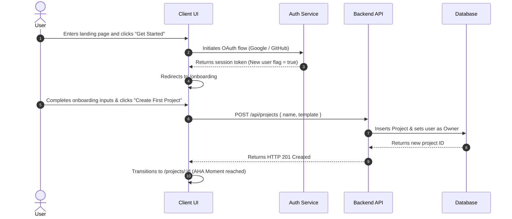

# Application Navigation & User Journey Flow (App Flow)

> **Document Version:** 1.0.0  
> **Last Updated:** [YYYY-MM-DD]  
> **Status:** [Active | Living]  
> **Repository:** [Repo Name]

---

## 1. Visual Screen Navigation Flowchart

The following diagram maps every screen, modal, and route transition across the entire application:

```mermaid
flowchart TD
    %% Entry & Auth
    Landing[Landing Page /] -->|Click Sign In| LoginModal[Login / Signup Modal /auth]
    Landing -->|Click Demo| DemoView[Interactive Demo /demo]
    
    LoginModal -->|Success: New User| Onboarding[Onboarding Wizard /onboarding]
    LoginModal -->|Success: Existing User| Dashboard[Main Dashboard /dashboard]
    LoginModal -->|Auth Error| LoginError[Toast Error / Retry]

    %% Onboarding Flow
    Onboarding -->|Step 1: Profile| Onboarding2[Step 2: Workspace Setup]
    Onboarding2 -->|Step 3: Preferences| Dashboard

    %% Core Application Navigation
    subgraph Authenticated App [/dashboard]
        Dashboard --> TopNav[Global Navigation Bar]
        Dashboard --> Sidebar[Sidebar Navigation]
        
        Sidebar --> ViewProjects[Projects /dashboard/projects]
        Sidebar --> ViewAnalytics[Analytics /dashboard/analytics]
        Sidebar --> ViewSettings[Settings /dashboard/settings]
        
        ViewProjects --> CreateModal[Create New Project Modal]
        CreateModal -->|Submit| ProjectDetail[Project Canvas /dashboard/projects/:id]
        
        ProjectDetail --> Editor[Live Editor / Workspace]
        ProjectDetail --> ExportDialog[Export / Share Dialog]
    end

    %% Settings & Admin
    ViewSettings --> TabGeneral[General Settings]
    ViewSettings --> TabBilling[Billing & Subscription]
    ViewSettings --> TabAPI[API Keys & Webhooks]

    %% Fallback
    Wildcard[404 Not Found /*] --> Landing
```

---

## 2. Comprehensive Route Matrix

| Route Path | View / Component | Access Level | Description | Key User Actions |
| :--- | :--- | :--- | :--- | :--- |
| `/` | `LandingPage` | Public | Hero, features, pricing, testimonials | CTA click, Auth trigger |
| `/auth` | `AuthModal` / `AuthPage` | Public | Login, Register, OAuth, Password Reset | Sign in, Sign up |
| `/onboarding`| `OnboardingFlow` | Authenticated (New) | Initial profile setup and project config | Step completion |
| `/dashboard` | `DashboardHome` | Authenticated | Main overview, recent activity, metrics | Quick actions, project launch |
| `/projects` | `ProjectList` | Authenticated | Grid of active user projects | Search, filter, create project |
| `/projects/:id`| `ProjectWorkspace`| Authenticated (Owner) | Interactive workspace / builder canvas | Edit, configure, share, delete |
| `/settings` | `SettingsView` | Authenticated | Account, billing, integrations | Update profile, manage sub |

---

## 3. Step-by-Step User Journeys

### 3.1 Primary Journey: First-Time User Activation (AHA Moment)


### 3.2 Secondary Journey: Returning User Core Task Execution
1. User navigates to `/dashboard`.
2. Auth middleware verifies session token; renders dashboard widgets immediately.
3. User selects project card -> Navigates to `/projects/:id`.
4. User modifies content -> Client triggers debounced auto-save (`PATCH /api/projects/:id`).
5. Live state badge switches from `Saving...` to `All changes saved`.

---

## 4. Edge Cases & Error Navigation Flows

- **Session Expiry / 401 Unauthorized**: Intercepted by client-side API wrapper -> preserves current URL state as `?returnTo=/projects/123` -> redirects to `/auth` -> on successful re-auth, automatically redirects back to the working project.
- **Permission Denied / 403 Forbidden**: Displays clean "Access Denied" empty state with "Request Access from Workspace Owner" CTA.
- **Resource Not Found / 404**: Shows custom 404 illustration with "Back to Dashboard" primary button.
- **Offline / Network Disconnect**: Displays sticky bottom notification banner ("Offline Mode - Changes queued locally").
