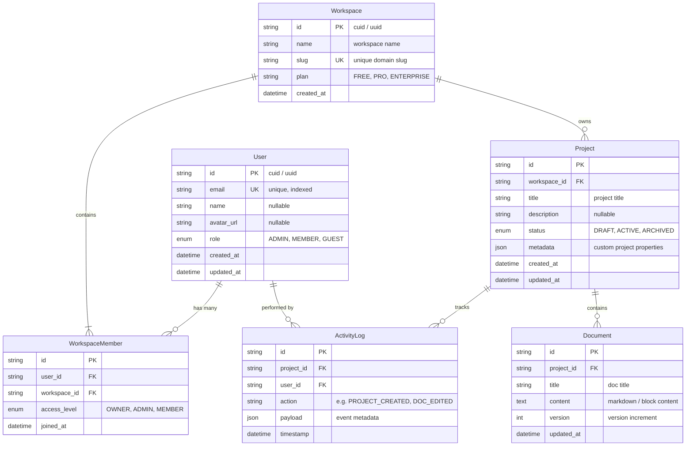
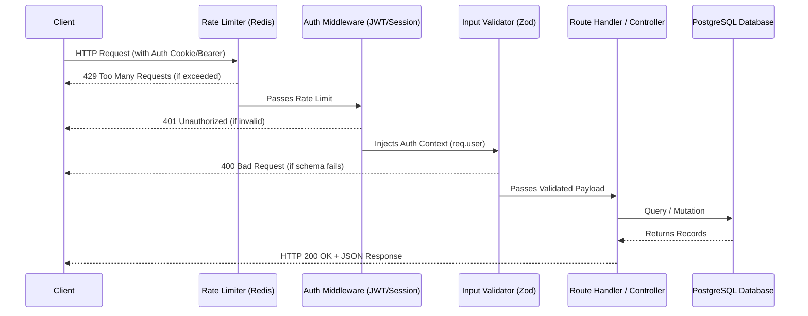

# Backend Schema & Data Architecture

> **Document Version:** 1.0.0  
> **Last Updated:** [YYYY-MM-DD]  
> **Status:** [Active | Living]  
> **Database Engine:** [PostgreSQL / MySQL / MongoDB / SQLite]  
> **ORM / Driver:** [Prisma / Drizzle / Mongoose / SQLAlchemy]

---

## 1. Visual Entity-Relationship (ER) Diagram

The following Mermaid diagram visualizes the database models, relations, foreign keys, and cardinalities:



---

## 2. Table & Model Specifications

### 2.1 Model: `User`
- **Description**: Stores authentication profiles and account settings.
- **Indexes**: `INDEX (email)`, `INDEX (created_at)`

| Field Name | Type | Constraints | Description |
| :--- | :--- | :--- | :--- |
| `id` | `String (UUID)` | `PRIMARY KEY, DEFAULT gen_random_uuid()` | Unique user identifier |
| `email` | `String` | `UNIQUE, NOT NULL` | Verified login email |
| `name` | `String` | `NULLABLE` | Display full name |
| `role` | `Enum (UserRole)`| `DEFAULT 'MEMBER'` | Authorization scope |
| `created_at` | `DateTime` | `DEFAULT now(), NOT NULL` | Account creation timestamp |

### 2.2 Model: `Project`
- **Description**: Top-level entity created and managed by users.
- **Indexes**: `INDEX (workspace_id)`, `INDEX (status)`

| Field Name | Type | Constraints | Description |
| :--- | :--- | :--- | :--- |
| `id` | `String (UUID)` | `PRIMARY KEY` | Unique project identifier |
| `workspace_id`| `String (UUID)` | `FOREIGN KEY -> Workspace(id) ON DELETE CASCADE` | Parent workspace |
| `title` | `String(255)` | `NOT NULL` | Project display name |
| `status` | `Enum (ProjectStatus)` | `DEFAULT 'DRAFT'` | Workflow lifecycle state |
| `metadata` | `JSONB` | `DEFAULT '{}'` | Extensible attributes |
| `updated_at` | `DateTime` | `DEFAULT now()` | Last modification time |

---

## 3. Core API Endpoints & Request/Response Contracts

### 3.1 Authentication & Profile
- `GET /api/v1/auth/me` -> Returns current authenticated `User` object.
- `PATCH /api/v1/user/profile` -> Body: `{ name?: string, avatar_url?: string }` -> Returns updated `User`.

### 3.2 Projects Resource
- `GET /api/v1/projects` -> Query: `?page=1&limit=20&status=ACTIVE` -> Returns `{ data: Project[], total: number }`.
- `POST /api/v1/projects` -> Body: `{ title: string, description?: string }` -> Returns `Project` (201 Created).
- `GET /api/v1/projects/:id` -> Returns single `Project` with associated `Document[]`.
- `PATCH /api/v1/projects/:id` -> Body: `{ title?: string, status?: ProjectStatus }` -> Returns updated `Project`.
- `DELETE /api/v1/projects/:id` -> Soft deletes / archives project -> Returns `{ success: true }`.

---

## 4. Data Flow & Middleware Pipeline



---

## 5. Migrations & Seed Instructions

```bash
# Run latest migrations
npx prisma migrate dev --name init_tables

# Apply seed data
npx prisma db seed

# Open visual database studio
npx prisma studio
```
