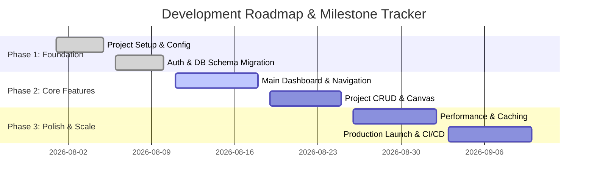

# Living Implementation Plan & Roadmap

> **Document Version:** 1.0.0  
> **Last Updated:** [YYYY-MM-DD]  
> **Status:** [Active | Living]  
> **Overall Progress:** [0% - 100%]

---

## 1. Executive Milestone Overview

---

## 2. Immediate Next Steps (Active Sprint)

> [!IMPORTANT]
> **Current Focus**: [Specify what is currently being worked on right now in 1 sentence.]
> **Target Deliverable**: [Specific user-facing or technical goal for this sprint.]

- [ ] **Active Task 1**: [Description of immediate coding step]
- [ ] **Active Task 2**: [Description of subsequent coding step]
- [ ] **Active Task 3**: [Verification & automated test run]

---

## 3. Phased Roadmap & Task Breakdown

### Phase 1: Foundation & Core Setup `[Progress: 100%]`
- [x] **Setup-01**: Initialize repository, package managers, and ESLint/TypeScript configurations.
- [x] **Setup-02**: Configure database connection and run initial schema migrations (`docs/backend-schema.md`).
- [x] **Setup-03**: Implement authentication providers and session management middleware.
- [x] **Setup-04**: Build baseline design tokens and UI shell (`docs/ui-ux-spec.md`).

### Phase 2: Core Domain Features `[Progress: 60%]`
- [x] **Core-01**: Build primary dashboard overview and metric summary cards.
- [x] **Core-02**: Implement project list view with search, filter, and pagination.
- [ ] **Core-03**: Build interactive project editor and canvas workspace.
- [ ] **Core-04**: Integrate real-time auto-saving and dirty state persistence.
- [ ] **Core-05**: Implement file export dialog and sharing permissions.

### Phase 3: Advanced Integrations & Optimization `[Progress: 0%]`
- [ ] **Adv-01**: Add third-party webhook receivers and async background worker.
- [ ] **Adv-02**: Implement Redis caching layer for high-throughput queries.
- [ ] **Adv-03**: Optimize Core Web Vitals (LCP < 1.2s, CLS < 0.05).
- [ ] **Adv-04**: Full automated E2E test suite with Playwright / Cypress.

---

## 4. Completed Milestones & Changelog

| Milestone / Task ID | Completed Date | Author / Agent | Summary of Changes |
| :--- | :--- | :--- | :--- |
| `Setup-01` to `Setup-04` | [YYYY-MM-DD] | Vibemax Swarm | Scaffolded initial workspace, auth, and database layer. |
| `Core-01` | [YYYY-MM-DD] | Agent | Shipped main dashboard UI with stats widgets. |
| `Core-02` | [YYYY-MM-DD] | Agent | Added project list filtering and sorting. |

---

## 5. Technical Debt & Backlog Items

- [ ] **Debt-01**: Refactor legacy API error formatting into unified Zod error interceptor.
- [ ] **Debt-02**: Add index to `created_at` column in `ActivityLog` table to optimize dashboard query.
